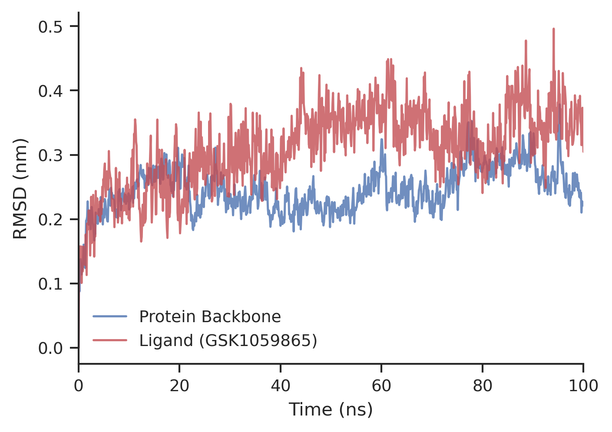
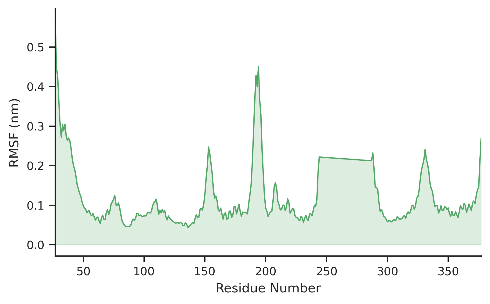
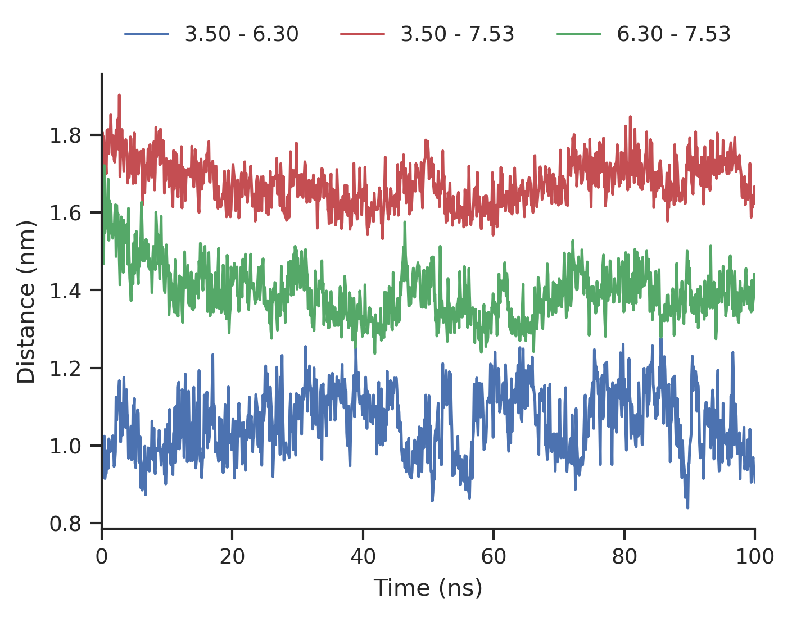

\newpage

# Introduction

The Orexin receptor system consists of two closely related Class A G-protein-coupled receptors (GPCRs), OX1R and OX2R, which are activated by the neuropeptides orexin-A and orexin-B. These receptors are central to the regulation of sleep-wake cycles, arousal, and motivated behavior. Specifically, OX1R has been strongly implicated in reward processing and addiction-related pathways, making it a high-value target for selective antagonists.

However, achieving subtype selectivity between OX1R and OX2R is challenging due to their highly conserved orthosteric binding sites (@fig-subtype). Rappas et al.[@rappas2020] provided a structural comparison of several antagonist-bound co-structures, concluding that selectivity is driven by a combination of lipophilic hotspots, water-mediated interactions, and distinct ligand poses.

{#fig-subtype}

In this study, we utilize all-atom molecular dynamics (MD) simulations to explore the conformational landscape of the human OX1R in complex with the selective antagonist GSK1059865 (PDB: 6TOS). Beyond standard structural analysis, we apply the Mutual Information Expansion (MIE) framework via the `PARENT_GPU` software suite to estimate the configurational entropy of the receptor. Recent work has highlighted that configurational entropy, rather than enthalpy alone, can be a primary driver of ligand recognition and selectivity in GPCRs[@yang2024].

# Methods

## System Preparation

The human Orexin-1 receptor (OX1R) was modeled based on the crystal structure PDB 6TOS, resolved at 2.13 Å. The system was built using the CHARMM-GUI Membrane Builder.

| Component | Details |
|:----------------------|:--------------------------------------------------------------|
| **Protein** | Unresolved loops and termini were modeled or truncated. Protonation states were assigned at pH 7.0 using Propka. |
| **Ligand (GSK1059865)** | Parametrized using the CHARMM General Force Field (CGenFF). During system setup, the ligand was erroneously modeled in an over-protonated state (net charge +3); this was identified only after the simulation and is treated as an important limitation of the present analysis. |
| **Membrane** | The protein was embedded in a mixed bilayer of 228 POPC and 24 CHL1 (Cholesterol) molecules (\~9.5 mol%). |
| **Solvation** | Explicit TIP3P water (23,342 molecules) was used. |
| **Ions** | 62 K+ and 76 Cl- ions were added to achieve a 150 mM salt concentration and neutralize the system (+11 protein, +3 ligand). |

: System Composition {#tbl-system}

## Force Field and Non-bonded Parameters

The CHARMM36m additive force field was used.

| Parameter | Setting |
|:------------------|:------------------------------------------------------|
| **Cutoff Scheme** | Verlet |
| **Neighbor List** | Updated every 20 steps |
| **Electrostatics** | Particle Mesh Ewald (PME) with a 1.2 nm real-space cutoff |
| **Van der Waals** | Cut-off with force-switching from 1.0 to 1.2 nm |

: Force Field Parameters {#tbl-forcefield}

## Simulation Protocol

Simulations were performed using GROMACS.

| Stage / Parameter | Setting |
|:------------------|:--------------------------------------------------------------------|
| **Minimization** | 5,000 steps of steepest descent. |
| **Equilibration** | A 6-stage protocol (1.875 ns total). Stages 1-2 (NVT): 1 fs timestep, strong positional restraints (4000 kJ/mol/nm² on backbone). Stages 3-6 (NPT): 2 fs timestep, semi-isotropic pressure coupling, gradual restraint release. |
| **Production** | 100 ns unrestrained MD in the NPT ensemble ($T=310.15$ K, $P=1$ bar). |
| **Thermostat** | v-rescale ($\tau_t = 1.0$ ps). |
| **Barostat** | C-rescale ($\tau_p = 5.0$ ps, semi-isotropic). |
| **Constraints** | H-bonds constrained with the LINCS algorithm. |

: Simulation Protocol {#tbl-protocol}

## Analysis and Configurational Entropy

Standard structural analyses, including RMSD, RMSF, and radius of gyration (Rg), were carried out using GROMACS. In addition, Principal Component Analysis (PCA) was performed on the receptor backbone after fitting the trajectory to the average structure in order to characterize the dominant collective motions sampled during the simulation. Configurational entropy was calculated with `PARENT_GPU`[@fleck2016]. For this analysis, a protein-only trajectory containing 5043 atoms and 1001 frames saved every 100 ps over the full 100 ns production run was used. Cartesian coordinates were first converted into internal Bond-Angle-Torsion (BAT) coordinates using `BAT_builder`. One-dimensional entropy terms and pairwise mutual information terms were then estimated from binned coordinate distributions using 50 bins. The total configurational entropy was finally approximated using the Maximum Information Spanning Tree (MIST) method, which retains the strongest pairwise correlations while remaining computationally tractable for large biomolecular systems[@fleck2016].

# Thermodynamic Background

Ligand binding is governed by the binding free energy, which reflects the balance between enthalpic stabilization and entropic cost or gain. In medicinal chemistry, structural interactions such as hydrogen bonds, electrostatics, and van der Waals contacts are often emphasized, but these static contacts alone do not determine affinity[@bissantz2010]. Binding is favorable only when the total free-energy change is negative, as shown in Eq. @eq-dg-bind:

$$
\Delta G_{\mathrm{bind}} = \Delta H_{\mathrm{bind}} - T \Delta S_{\mathrm{bind}}
$$ {#eq-dg-bind}

The entropic contribution to binding is therefore given by Eq. @eq-entropic-term:

$$
-T \Delta S_{\mathrm{bind}}
$$ {#eq-entropic-term}

In this report, the focus is on configurational entropy, meaning the entropy associated with the ensemble of conformations sampled by the receptor during the MD trajectory. This is not the same as directly calculating the full binding entropy, $\Delta S_{\mathrm{bind}}$, for the protein-ligand system. Instead, it provides a receptor-centered measure of how broadly or narrowly the simulated conformational ensemble is distributed. In statistical thermodynamic terms, configurational entropy can be written as Eq. @eq-sconf:

$$
S_{\mathrm{conf}} = -R \int p(\mathbf{q}) \ln p(\mathbf{q}) \, d\mathbf{q}
$$ {#eq-sconf}

where $p(\mathbf{q})$ is the probability density over internal coordinates $\mathbf{q}$ and $R$ is the gas constant. A broader conformational distribution corresponds to higher configurational entropy, whereas a narrow distribution indicates a more restricted and entropically penalized state.

Because biomolecules have many correlated internal motions, total configurational entropy cannot be estimated accurately by summing independent one-dimensional terms alone. The Mutual Information Expansion (MIE) addresses this by decomposing the entropy into single-coordinate entropies corrected by correlation terms. Truncated at the pairwise level, the expression becomes Eq. @eq-mie:

$$
S \approx \sum_i S_i - \sum_{i<j} I_{ij}
$$ {#eq-mie}

where $S_i$ is the entropy of coordinate $i$ and $I_{ij}$ is the mutual information between coordinates $i$ and $j$. Mutual information quantifies how strongly two internal motions are statistically coupled; if two coordinates move independently, their mutual information is zero.

The Maximum Information Spanning Tree (MIST) is a related approximation that keeps only the most informative pairwise couplings in a spanning-tree representation of the system. This reduces the computational cost while preserving the dominant correlation network. Fleck et al. reported that, for large biomolecular trajectories, MIST often converges more robustly than a broader pairwise MIE estimate[@fleck2016]. For GPCR systems, this type of analysis is particularly relevant because recent work has shown that subtype-selective ligand recognition can be strongly influenced by entropic differences in receptor dynamics[@yang2024].

# Results

## System Equilibration

Before running the main production simulation, the system must be properly equilibrated. This means bringing it to the correct temperature (310.15 K) and pressure (1 bar), allowing the lipids, water, and ions to relax around the protein without distorting its structure. We used a careful 6-stage protocol, gradually releasing restraints on the protein.

By the final 100 ps of the stage-6 equilibration, the key thermodynamic properties had stabilized, indicating that the system was ready for production data collection. The temperature remained close to the target value, averaging 310.34 ± 1.19 K, while the pressure showed the large instantaneous fluctuations expected for a system of this size but averaged 18.25 ± 102.87 bar around the 1 bar target. The density converged to 1018.52 ± 1.30 kg/m³, which is consistent with a well-equilibrated solvated lipid bilayer system. The potential energy stabilized around -1,007,351 kJ/mol without further downward drift, confirming that the system had become energetically relaxed. In parallel, the box dimensions in both the membrane plane and membrane normal direction plateaued, with Box-X near 9.23 nm and Box-Z near 12.32 nm, further supporting equilibration of the membrane-protein system.

## Structural Stability

To determine if our simulated protein-drug complex is stable over time, we monitor the Root Mean Square Deviation (RMSD). RMSD measures the average distance that atoms have moved from their starting positions. A rising RMSD indicates the structure is changing, while a plateau indicates it has settled into a stable, relaxed state. We also track the Radius of Gyration (Rg), which measures the overall compactness of the protein.

The 100 ns trajectory shows a highly stable complex. The protein backbone RMSD plateaued at roughly 0.25 nm, indicating that the receptor maintains its overall fold without significant distortion. Crucially, the ligand RMSD also remained low and stable, meaning the antagonist (GSK1059865) remained tightly bound within the orthosteric pocket throughout the simulation. The steady Radius of Gyration confirms the protein did not artificially unfold or expand.

| Metric                 | Mean ± SD     | Unit |
|------------------------|---------------|------|
| Protein Backbone RMSD  | 0.245 ± 0.036 | nm   |
| Ligand RMSD (prot-fit) | 0.311 ± 0.063 | nm   |
| Radius of Gyration     | 2.302 ± 0.012 | nm   |

## Local Flexibility (RMSF)

While RMSD looks at the whole protein, Root Mean Square Fluctuation (RMSF) tells us how much each individual amino acid moves. This is important for identifying flexible loops versus rigid structural core elements.

As expected for a membrane protein, the residues forming the transmembrane helices (TM) show very minimal fluctuations (\< 0.1 nm), as they are tightly packed and restricted by the surrounding lipid bilayer. In contrast, the extracellular loops (ECL) and intracellular loops (ICL), which are exposed to the watery environment, exhibit much higher flexibility (@fig-rmsf). This pattern confirms that the simulation behavior is physically realistic.

{#fig-rmsf}

## Principal Component Analysis

Proteins consist of thousands of atoms constantly in motion. Principal Component Analysis (PCA) is a mathematical technique used to filter out the random background noise and identify the most important, large scale, coordinated movements of the protein (like twisting or opening/closing motions).

Our PCA results (@fig-pca) summarize the essential dynamics of the receptor. The Explained Variance by PC and Cumulative Variance plots show that the first few principal components capture the majority of the protein's overall motion. Specifically, the conformational space sampled by the receptor is well-captured by the first two principal components (PC1 and PC2), which together explain 37.2% of the total variance in motion.

The PC Projections Over Time plot confirms that these large-scale motions do not drift continuously, but rather oscillate stably, characteristic of a well equilibrated structure. Finally, the Conformational Space (PC1 vs PC2) plot, colored by simulation time, illustrates that rather than moving randomly, the receptor remains confined to a stable conformational basin, confirming it is securely locked in its inactive state by the antagonist.

{#fig-pca}

## GPCR Activation Markers

GPCRs like OX1R transmit signals by undergoing major shape changes. Specifically, the outward movement of transmembrane helix 6 (TM6) to create a binding site for G-proteins inside the cell. To verify whether our simulated receptor is in an active or inactive state, we monitored the distances between highly conserved amino acids known to move during activation: Arg144 (3.50), Arg293 (6.30), and Tyr358 (7.53).

Because GSK1059865 is an antagonist (a blocker), we expect it to hold the receptor in the inactive state. The stability of the TM3-TM6 (3.50-6.30) distance at approximately 1.06 nm confirms this; the helices remain close together, preventing G-protein binding. Interestingly, while many GPCRs are held inactive by a specific salt bridge called an ionic lock, OX1R lacks this feature (Arg293 is basic). Despite this, our distance analysis proves the receptor remains stably inactive, suggesting other interactions within the protein successfully maintain the closed TM3-TM6 conformation.

## Configurational Entropy Calculation

Configurational entropy provides a dynamic complement to the structural analyses above. Whereas RMSD, RMSF, and PCA describe how the receptor moves, the entropy analysis quantifies how broadly the receptor samples its accessible conformational space. If ligand binding constrains the receptor into a narrow ensemble, the configurational entropy decreases and the entropic term opposes favorable binding unless it is compensated by sufficient enthalpic stabilization[@bissantz2010].

The `PARENT_GPU` analysis yields a total configurational entropy of -31,851.62 J/mol/K for the sampled receptor ensemble. This strongly negative value is consistent with a highly restricted conformational distribution in the simulated complex. However, it should not be interpreted as the total binding free energy or as a direct measurement of $\Delta S_{\mathrm{bind}}$ on its own; rather, it represents one receptor-centered component of the overall thermodynamic balance and must be considered alongside enthalpic, solvent, and ligand contributions. The associated pairwise mutual-information correction terms sum to approximately 8204.71 J/mol/K, indicating substantial coupling between internal motions beyond the one-dimensional entropy terms alone. The breakdown of specific internal-coordinate terms (bonds, angles, and dihedrals) is provided below:

| Component                                | Entropy Value (J/mol/K) |
|------------------------------------------|-------------------------|
| Total 1D Bonds Entropy                   | -13487.40               |
| Total 1D Angles Entropy                  | -7366.60                |
| Total 1D Dihedrals Entropy               | -2792.91                |
| **Total Configurational Entropy (MIST)** | **-31851.62**           |

# Discussion and Conclusion

The 100 ns simulation of OX1R bound to GSK1059865 supports the structural integrity of the complex in a physiological-like membrane environment. The convergence of RMSD and PCA results suggests that the system sampled a stable conformational basin within the simulated timeframe, and the activation marker analysis places the receptor in the quiescent state expected for an antagonist-bound complex.

While the simulation demonstrates high stability, it is essential to contextualize the electrostatic model of the ligand. GSK1059865 contains a bromopyridinyl/aminopyridine-like heteroaromatic motif and does not contain a strongly basic tertiary amine in its final scaffold[@gtopdbgsk1059865]. By structural analogy, aminopyridines are only modestly basic; for example, 2-aminopyridine has a reported pKa of about 6.9[@pubchem2aminopyridine]. It is therefore reasonable to expect that the neutral form of GSK1059865 would dominate near physiological pH, although this is an inference from structure rather than a directly measured pKa for this exact ligand. In this work, however, the ligand was modeled with a net charge of +3. This was later recognized as an error in protonation-state assignment. The over-protonated ligand likely exaggerated electrostatic coupling within the binding pocket, particularly with residues such as Asp203, and may therefore have overstated the magnitude of receptor rigidification and the exceptionally negative configurational entropy observed (-31,851.62 J/mol/K).

The inclusion of configurational entropy analysis via `PARENT_GPU` remains a significant improvement over a purely static structural interpretation. As highlighted by Yang et al., entropic differences can be decisive drivers of GPCR ligand recognition[@yang2024]. At the same time, this case provides an important methodological lesson: accurate protonation-state assignment is essential when interpreting binding thermodynamics from MD trajectories. The values presented here are therefore best viewed as describing a strongly coupled inactive-state ensemble generated under an erroneous ligand charge model, rather than as a definitive thermodynamic description of the physiological complex. Future work should prioritize simulation of the neutral antagonist and, ideally, comparison to an unbound receptor reference state. That would allow a more defensible estimate of the thermodynamic consequences of binding and help separate genuine receptor stabilization from artifacts introduced by the incorrect protonation state.

# References
